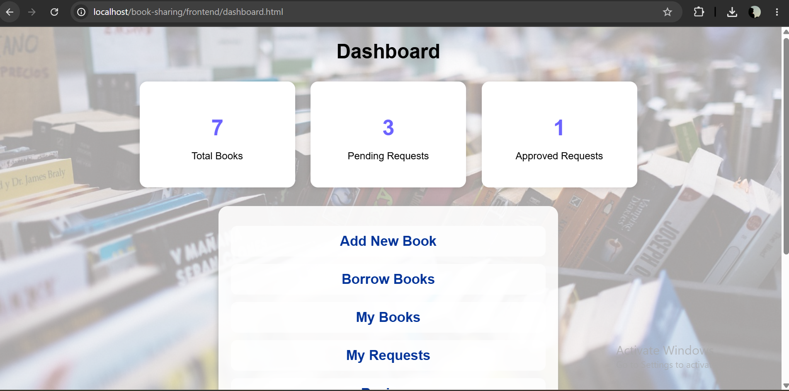
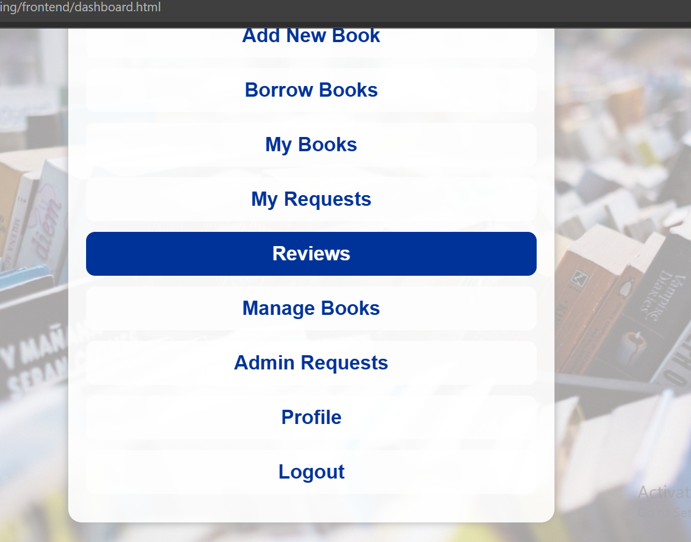
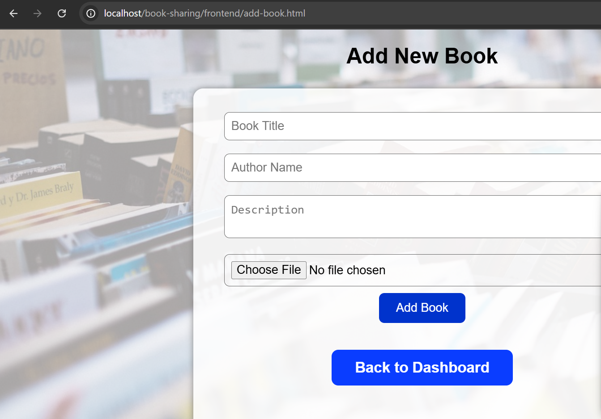
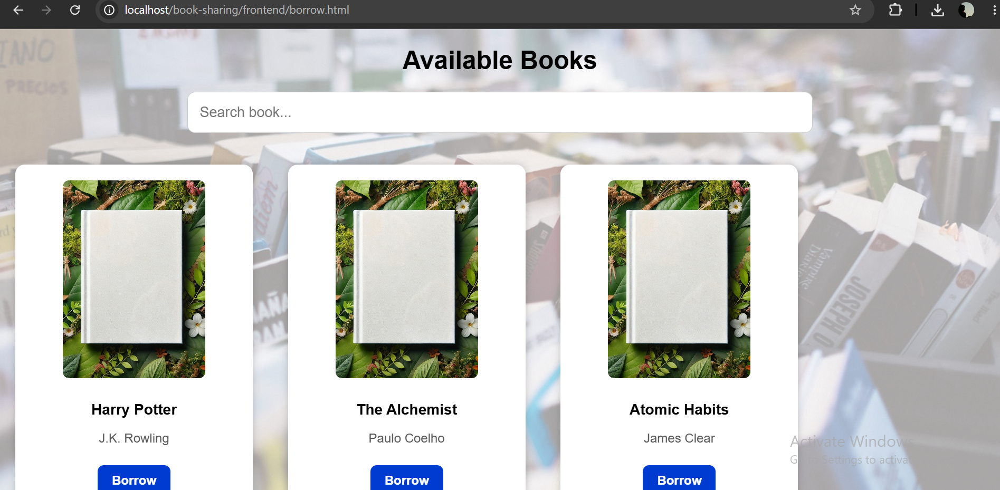
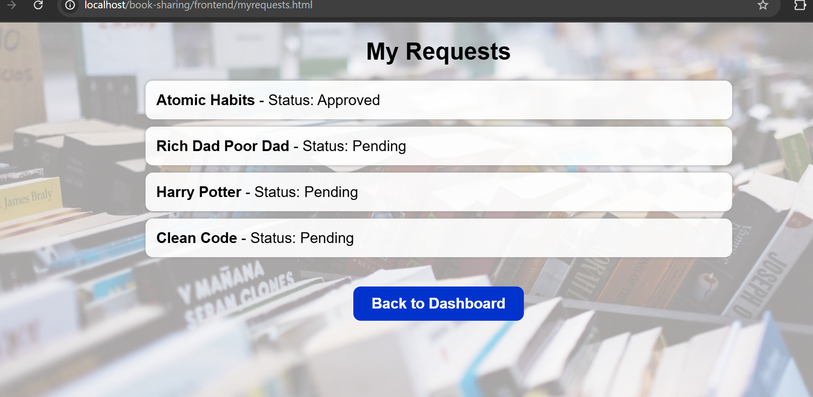
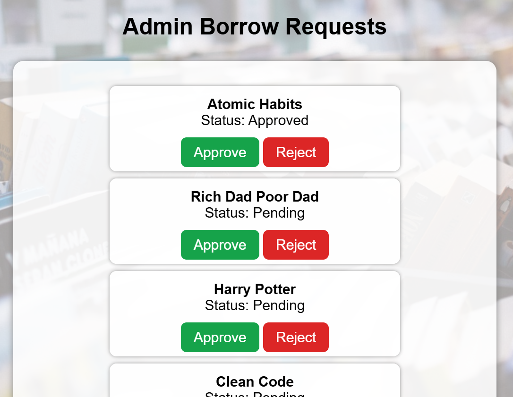

# 📚 Book Sharing System

A web-based Book Sharing System developed using PHP, MySQL, HTML, CSS and JavaScript.

## Features

- User Registration & Login
- Dashboard
- Add New Books
- Upload Book Images
- Search Books
- Borrow Books
- My Books
- My Requests
- Book Reviews
- User Profile
- Edit & Delete Books
- Admin Request Management

## Technologies Used

- PHP
- MySQL
- HTML5
- CSS3
- JavaScript
- XAMPP

## Installation

1. Clone this repository.
2. Copy the project into XAMPP `htdocs`.
3. Import `bookshare_db.sql` into phpMyAdmin.
4. Start Apache and MySQL.
5. Open:

```
http://localhost/book-sharing/frontend/
```

## Project Structure

```
backend/
frontend/
images/
bookshare_db.sql
README.md
```
---

# 📸 Screenshots

## Login Page


## Dashboard




## Dashboard (Admin)




## Add Book



---

## Manage Books


## Borrow Books



---

## My Books


## My Requests




## Reviews


## Admin Borrow Requests




GitHub: https://github.com/arpita201
## Author

**Arpita Saha**
